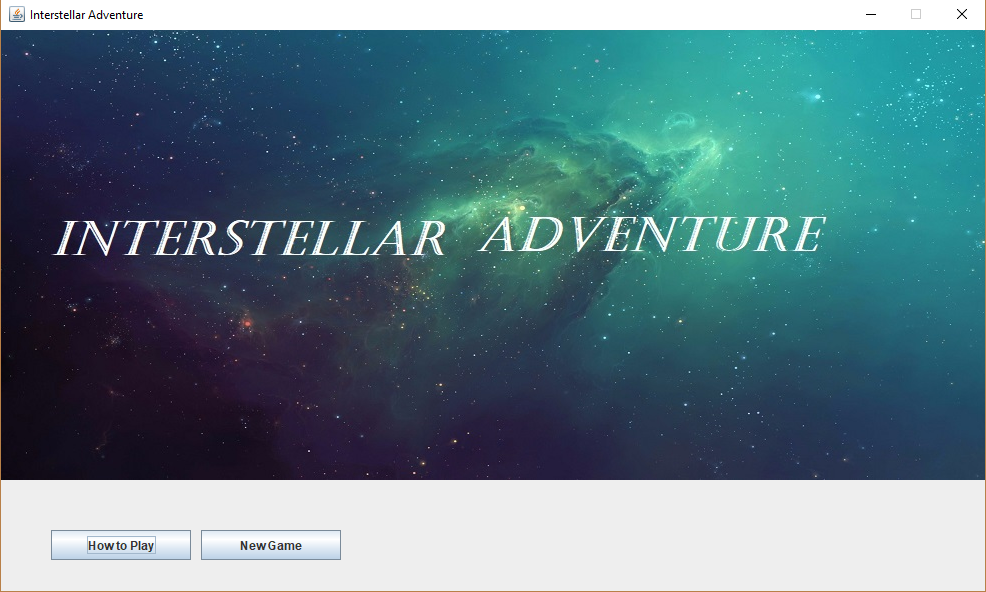

# Interstellar Adventure

## About

**Interstellar Adventure** was originally a university project, in which students were asked to create basic GUI adventure game.
The theme of the game is that a crew are stranded somewhere in space as their ship has lost some of it's parts during it's hyper jump. The player is given a set time to explore the planets around them in search of these parts. The also required that there be an implementation of an inventory and a in-game shop. The guidelines for the project stated that students implement some form of random event, in this case the game as alien attacks, space plauge, and space obstructions.

## Future plans

Personally I had a great deal of fun working on this project. This is why I plan to continue development on the project, enchance the inventory and shop experience. While adding a few more engaging features, such as ship battles and alien brawls where the player is able to make desicions that will help define the outcome of the event. The game could also do with some work on it's visual appeal with some images and art work.

## What I learnt

Many things were learnt through this project, one of the biggest lessons being how to plan and prepare for the building of software which contains many different linked parts. Getting a grasp on how to structure the software and it's modules in such a way that the project is easy to navigate. As well as being easily linkable to future modules/sections.

This project forced me to learn how to think about how to builld software in such a way that it can be easily expanded and added to. A specific example being the different screens. Being implemeted in such a way that there is a simple pattern to follow that will make it so one can always add new displays to the main screen, and removing the need for multiple windows. This pattern further allowed the different displays themselves to be modular, instead of bundling huge amounts of code in one file each screen can be put into it's own file making the code for any given section of the software readable.

With one goal being that the software needs to be as light weight as possible, it raised an issue on how to deal with game data. Specifically if a user or multiple users wanted to have there own game, this would require a saved game implemented in one way or another. The solution being to simply have game data written and read from text files. This would mean that there is no need to attach a database and/or add another dependency. However it required a bit of learning with regards to what might be the best way to read and write this saved data in such a way that it does not become a heavy or time consuming task for the software. Thus allowing me to learn in more detail the ins and out of working with files, strings, and the OS.

